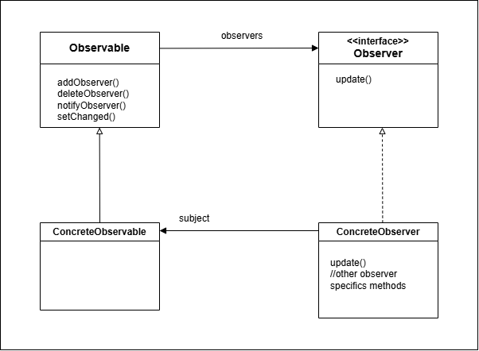

# Observer pattern

Define un dependencia uno a muchos entre objetos de tal forma que cuando un objeto cambia de estado, todos sos dependientes son notificados y actualizados automáticamente.

## Principio de diseño
Esforzarse para tener diseños debilmente acoplados entre los objetos que interactuan.


- La interface Subject es usada para registrar y eliminar observadores.
- La clase que implemente Subject debe implementar también notifyObservers(), método usado para actualizar los observadores con los cambios de estado.
- Caada subject tiene mucho observers.
- La interface Observer tiene el metodo update, el cual es ejecutado por el Subject cuando hay un cambio de estado.
- La clase que implementa Observer será un observador y deberá registrarse como tal en algún subject concreto para recibir los updates.

# Patrón Observer integrado de Java



- La clase Observable mantiene la lista de los observadores y los notifica por nosotros.
- Observable es un clase, no una interface como en el enfoque anterior.
- La clase que hará de "Subject" ahora no debe implementar los metodos para registrar, eliminar ni notificar observadores, porque ahora los hereda de la super clase Observable.
- La interface Observer se comporta como en el enfoque anterior.
- Lo mismo que las clase concretas que serán los observadores.

Para que un objeto se vuelva observador implementa la interface Observer y llama addObserver() en algun objeto Observable.
Para que el Observable envíe notificaciones debe extender Observable, luego llamar setChanged() para avisar que el etado cambió y luego notifyObservers() el cual tiene esa versión y notifyObservers(Object arg)
Para que un observador reciba una notificación implementa update(Observable o, Object arg)
Si se desea "pushear" datos a los observadores, se puede pasar el dato como un objeto a notifyObservers(arg). Se no, entonces el Observer debe "pullear" los datos  si quiere que el Observable le pase el dato.

El método nuevo que aparece, setChanged() se usa para avisar que el estado cambió y que cuando se llame notifyObservers() deberían actualizarse los observadores. Si se llama notifyObservers() sin llamar ante a setChanged() no se enviarán las notificaciones:

```
setChanged() {
changed = true
}

notifyObservers(Object arg) {
	if(changed) {
		for every observer on the list {
			call update(this, arg)
		}
	}
	changed = false
}

notifyObservers() {
	notifyObservers(null)
}
```

Sirve para dar flexibilidad al optimizar las notificaciones.

