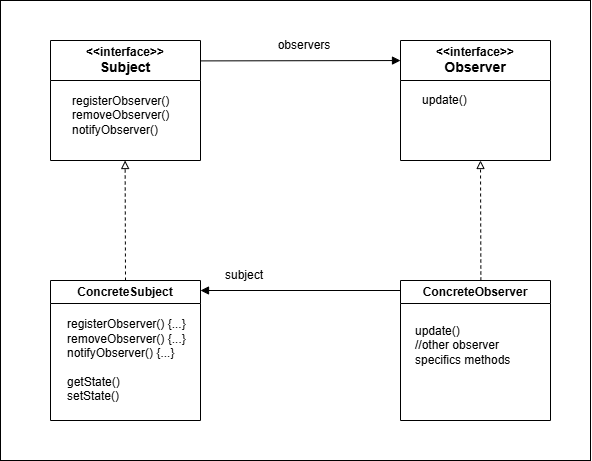

# Observer pattern

- La interface Subject es usada para registrar y eliminar observadores.
- La clase que implemente Subject debe implementar también notifyObservers(), método usado para actualizar los observadores con los cambios de estado.
- Caada subject tiene mucho observers
- La interface Observer tiene el metodo update, el cual es ejecutado por el Subject cuando hay un cambio de estado.
- La clase que implementa Observer será un observador y deberá registrarse como tal en algún subject concreto para recibir los updates.